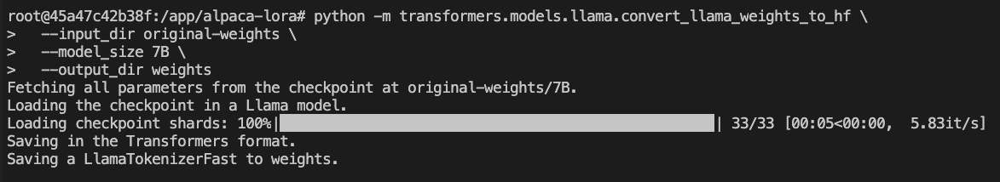

转换模型格式
接着，在容器中执行下面的命令，就能够将 Meta 7B 的 LLaMA 模型，转换为我们需要的格式了：

```shell

python -m transformers.models.llama.convert_llama_weights_to_hf \
  --input_dir original-weights \
  --model_size 7B \
  --output_dir weights

```

