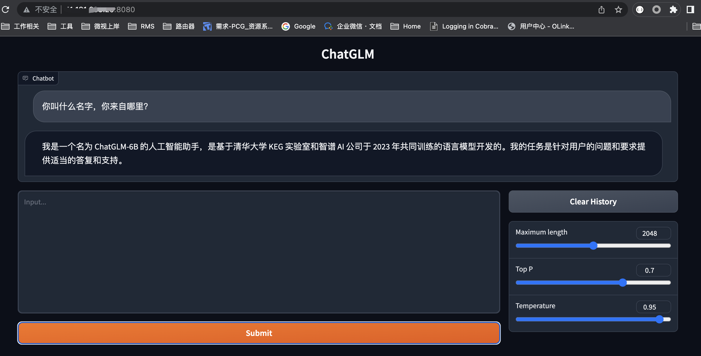

## ChatGLM-6B 相关模型的Fine-tuning

该项目通过Docker镜像为大家提供一个整合好的Fine-tuning环境，使用它可以对ChatGLM-6B模型进行finetune。
如果你发现默认镜像不符合你的要求，也可以在基础dockerfile上更新，构建适合你的镜像


### 前置条件
已经安装好Docker和cuda驱动

验证Docker是否正常运行

```shell
docker run hello-world
```

验证cuda驱动正确安装
```shel
nvidia-smi
```

输出示例如下
```
Wed Apr 19 12:14:17 2023       
+-----------------------------------------------------------------------------+
| NVIDIA-SMI 525.105.17   Driver Version: 525.105.17   CUDA Version: 12.0     |
|-------------------------------+----------------------+----------------------+
| GPU  Name        Persistence-M| Bus-Id        Disp.A | Volatile Uncorr. ECC |
| Fan  Temp  Perf  Pwr:Usage/Cap|         Memory-Usage | GPU-Util  Compute M. |
|                               |                      |               MIG M. |
|===============================+======================+======================|
|   0  Tesla T4            On   | 00000000:00:09.0 Off |                    0 |
| N/A   30C    P8     8W /  70W |      2MiB / 15360MiB |      0%      Default |
|                               |                      |                  N/A |
+-------------------------------+----------------------+----------------------+
|   1  Tesla T4            On   | 00000000:00:0A.0 Off |                    0 |
| N/A   31C    P8     9W /  70W |      2MiB / 15360MiB |      0%      Default |
|                               |                      |                  N/A |
+-------------------------------+----------------------+----------------------+
                                                                               
+-----------------------------------------------------------------------------+
| Processes:                                                                  |
|  GPU   GI   CI        PID   Type   Process name                  GPU Memory |
|        ID   ID                                                   Usage      |
|=============================================================================|
|  No running processes found                                                 |
+-----------------------------------------------------------------------------+
```

### 构建自己的镜像（可选）

1. 编辑 docker/Dockerfile.chatglm-finetune 文件
2. 构建镜像
```shell
cmd/build_image4chatglm.sh
```
3. PUSH镜像到仓库（可选）

### 启动chatglm推理服务

1. pull镜像
   由于外网dockerhub网速慢，所以我直接把镜像推到公司内镜像仓库，大大提升镜像下载速度
   ```shell
    docker pull mirrors.tencent.com/rms/llama_finetune:chatglm
   ```

2. 下载原始ChatGLM-6B模型
   
   ```shell
   cmd/down_model.sh -m chatglm6b
   ```
   提示：不是每次都要重新下载原始模型文件，只需要下载一次即可，成功下载后，模型文件在models目录下，如下图：
   ```
   (base) [root@11-181-233-20 models]# tree chatglm-6b/
      chatglm-6b/
      ├── config.json
      ├── configuration_chatglm.py
      ├── ice_text.model
      ├── LICENSE
      ├── modeling_chatglm.py
      ├── MODEL_LICENSE
      ├── pytorch_model-00001-of-00008.bin
      ├── pytorch_model-00002-of-00008.bin
      ├── pytorch_model-00003-of-00008.bin
      ├── pytorch_model-00004-of-00008.bin
      ├── pytorch_model-00005-of-00008.bin
      ├── pytorch_model-00006-of-00008.bin
      ├── pytorch_model-00007-of-00008.bin
      ├── pytorch_model-00008-of-00008.bin
      ├── pytorch_model.bin.index.json
      ├── quantization.py
      ├── README.md
      ├── tokenization_chatglm.py
      └── tokenizer_config.json
    ```
3. 启动推理服务（web chat)
   ```bash
   ./cmd/generate_chatglm.sh
   ```
   打开浏览器，输入服务器IP+8080端口即可访问
   


4. Fine-tune(参数微调)
   [原文档参考](https://github.com/THUDM/ChatGLM-6B/tree/main/ptuning)

   

  enjoy it ~~~